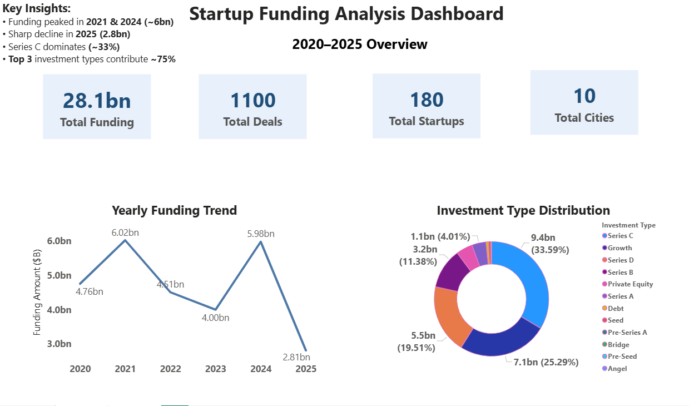
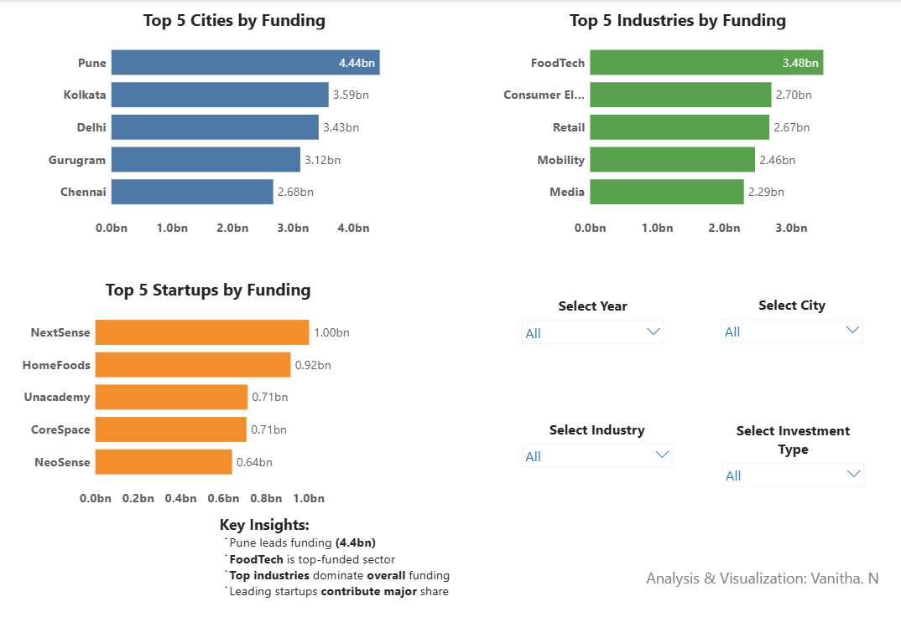

# Indian Startup Funding Analysis (2020–2025)

End-to-end analysis of Indian startup funding trends using SQL, Excel, and Power BI.

## Key Highlights
- Funding peaked in 2021 and 2024  
- FoodTech was the top-funded industry  
- Pune led all cities in funded startups  
- Series B/C rounds had the highest average deal sizes  

## Tools Used
- MySQL  
- Microsoft Excel  
- Power BI  

## Dashboard Preview
  

## Files Included
- `raw_startup_funding.csv` — Original dataset  
- `Indian_Startup_Funding_Cleaned.csv` — Cleaned dataset  
- `analysis_queries.sql` — SQL queries for cleaning and analysis  
- `Startup_Funding_Analysis.pbix` — Power BI dashboard  

## Data Cleaning
- Converted `Date` column using STR_TO_DATE()  
- Removed duplicates and null values  
- Standardized city and industry names  

## Analysis Coverage
Yearly trends · Industry analysis · City analysis · Investment types · Investor activity · Large deals (>$10M)

## Author
Vanitha N  
Data Analyst | SQL | Power BI | Excel  

LinkedIn: https://linkedin.com/in/vanitha-n-161a043b3  
Email: vanithavijay2103@gmail.com
